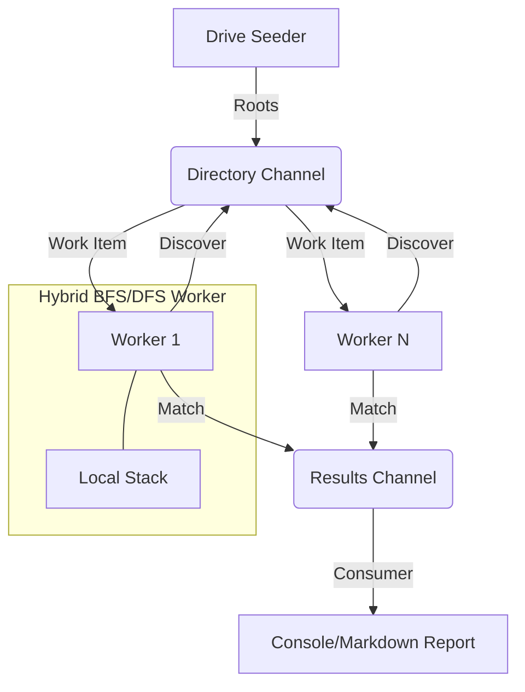
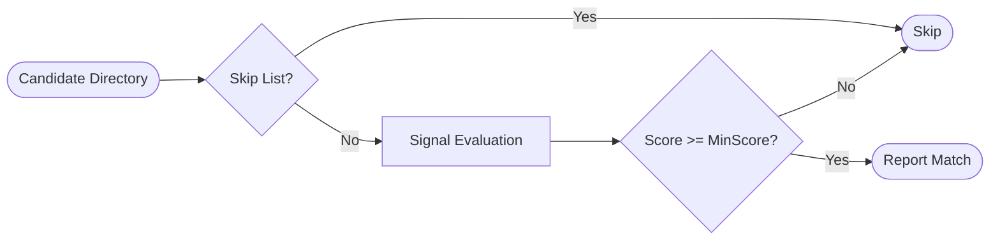

# App User Data Scanner

## Downloads
**Latest Stable Release:**
- [**Download win-x64.exe**](https://github.com/ahmadmdabit/AppUserDataScanner/releases/latest/download/AppUserDataScanner-win-x64.exe) (Recommended for most Windows 10/11)
- [**Download win-x86.exe**](https://github.com/ahmadmdabit/AppUserDataScanner/releases/latest/download/AppUserDataScanner-win-x86.exe)

## Executive Summary
**App User Data Scanner** is a high-performance, zero-allocation directory crawler designed for the identification and scoring of Chromium and Electron-based application profiles. Engineered for Windows 10/11 environments, it utilizes a multi-threaded Breadth-First Search (BFS) architecture to traverse massive directory trees (e.g., `AppData`, `Program Files`) with minimal CPU and memory overhead.

## Common Use Cases
1.  **Enterprise Profile Migration**: Automated discovery of user data roots for profile state-transfer during hardware refreshes or VDI provisioning.
2.  **Post-Incident Forensic Analysis**: Low-impact identification of non-standard or portable browser installations and profile locations during digital investigations.
3.  **Storage Analytics & Quota Enforcement**: Quantifying the cumulative disk footprint of Electron-based cache and metadata structures across high-density multi-user systems.
4.  **Data Privacy Compliance Auditing**: System-wide scanning for "shadow" browser profiles containing potentially sensitive cached credentials or PII.
5.  **Orphaned Data Identification**: Detection of residual application data from uninstalled Chromium/Electron applications to reclaim high-churn disk sectors.

## Architecture & Design
The system is built on a **Producer-Consumer** pattern using `System.Threading.Channels` for non-blocking orchestration and backpressure management.

### System Flow


### Key Technical Pillars
1.  **Orchestration**: `Parallel.ForEachAsync` manages a pool of stateless `DirectoryWorker` instances.
2.  **Memory Optimization**: 
    *   **Span-based Filtering**: `ReadOnlySpan<char>` is used for all path segment extractions and skip-list lookups to achieve zero-allocation in the hot path.
    *   **Frozen Collections**: `FrozenDictionary` and `FrozenSet` (introduced in .NET 8) provide O(1) read-only lookups with zero heap overhead during execution.
    *   **Object Pooling**: `StringBuilder` instances are recycled via `ObjectPool` to prevent Gen0 GC pressure during logging.
3.  **Concurrency Control**:
    *   **Bounded Channels**: Prevents unbounded memory growth if enumeration outpaces detection.
    *   **Two-Phase Completion**: A `WorkTracker` using `Interlocked` operations ensures the scan only completes when both the channel is empty AND all workers have finished processing their last item.
4.  **Resilience**:
    *   **Hang Detection**: Real-time monitoring of `TotalDirsScanned`. If progress stalls while work is pending, worker states and current paths are dumped to the log.
    *   **Pathological Pruning**: Hard limits on subdirectory counts (2,000) per folder prevent "recursive explosion" hangs in corrupted or infinite NTFS structures.

## Detection Logic
Detection is score-based, evaluating "signals" (existence of specific files/directories) against weighted detectors.



## Execution Modes

### 1. Interactive Mode (Wizard)
Launching the application without arguments triggers a guided setup wizard. This is ideal for manual scans where you want to tune parameters via a step-by-step interface.
```bash
# Launch without arguments
AppUserDataScanner.exe
```

### 2. CLI Mode
For automation and high-performance tuning, the following parameters are supported:

| Long Flag | Short | Description | Default |
| :--- | :--- | :--- | :--- |
| `--workers` | `-w` | Number of parallel worker tasks | 4 |
| `--max-depth` | `-d` | Maximum directory recursion depth | 12 |
| `--min-score` | `-s` | Minimum detection score to report | 3 |
| `--min-size` | `-S` | Minimum directory size (e.g., 1GB, 500MB) | None |
| `--report` | `-r` | Generate a Markdown report file | Disabled |
| `--verbose` | `-v` | Enable debug-level diagnostic logging | Info |
| `--help` | `-h` | Show technical help message | - |

#### Examples:
```bash
# High-parallelism scan with score threshold
AppUserDataScanner.exe -w 8 -s 5

# Conservative scan with shallow depth and size filter
AppUserDataScanner.exe -d 8 -S 100MB

# Generate report with verbose diagnostic output
AppUserDataScanner.exe -r -v
```

## Project Structure
```text
src/AppUserDataScanner/
├── Detection/       # Score-based heuristics (Chromium, Electron)
├── Infrastructure/  # Zero-allocation path utils, SkipLists
├── Reporting/       # Thread-safe metrics and report generation
├── Scanner/         # Channel-based orchestration and workers
└── Program.cs       # Entry point and DI/Logging setup
```

## Tech Stack
*   **Runtime**: .NET 10 (LTS Recommended)
*   **Deployment**: NativeAOT (Ahead-of-Time compilation) enabled for Release builds.
*   **Logging**: [ZLogger](https://github.com/Cysharp/ZLogger) (Zero-allocation structured logging)
*   **Serialization**: [Utf8StringInterpolation](https://github.com/Cysharp/Utf8StringInterpolation)
*   **Data Structures**: `System.Collections.Frozen`

## Performance Requirements
*   **NativeAOT Compatibility**: Avoid runtime reflection and dynamic code generation to ensure full AOT support.
*   **Zero-Allocation**: Maximize `Span<T>` usage; avoid `string.Substring` or `path.Split`.
*   **Reflection-less**: Avoid runtime reflection; prefer static metadata or source generators.
*   **Async/Non-blocking**: All I/O must be asynchronous; no `Task.Wait()` or `.Result`.
*   **Zero-Dependency**: Minimize 3rd party libraries to reduce binary footprint and supply chain risk.

## License
Distributed under the MIT License. See [LICENSE](LICENSE) for details.
